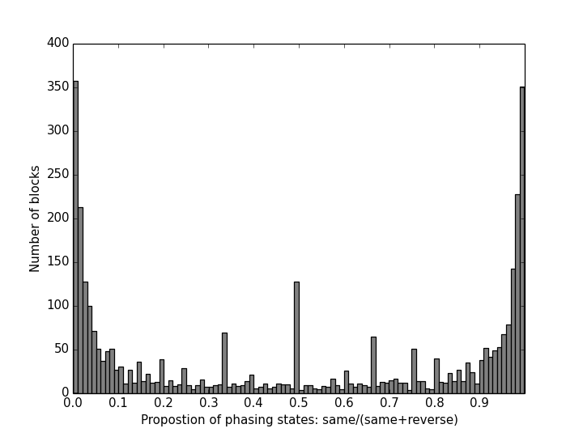

# Genome phasing
This is a pipeline to phase a genome into two homeologous subgenomes. The assumption is that there is limited recombination between two subgenomes (e.g. disomic inheritance). Parental genomes are required.

Originally, the pipeline was developed to phase genomes of *Capsella bursa-pastoris* (Brassicaceae):

[Kryvokhyzha et al. Parental legacy, demography, and admixture influenced the evolution of the two subgenomes of the tetraploid Capsella bursa-pastoris (Brassicaceae). PLoS Genet. 2019](http://doi.org/10.1371/journal.pgen.1007949)

[Kryvokhyzha et al. Towards the new normal: Transcriptomic convergence and genomic legacy of the two subgenomes of an allopolyploid weed (Capsella bursa-pastoris). PLoS Genet. 2019](http://doi.org/10.1371/journal.pgen.1008131)

The phasing is performed in two stages:

1. Generate phased haplotype blocks using [HapCUT](https://github.com/vibansal/hapcut)
2. Merge haplotype blocks into two continuous strings.

Preparing reference parental genomes performed as an intermediate step.

Required files:  

1) VCF file with samples to phase  
2) BAM files for samples to phase  
3) VCF file with parental genomes  
4) FASTA file with a reference genome  

All python script contain description of input and output data format in the header of each file.
To see possible option, run python script with --help option:
`python script.py --help`

## Generate phased haplotype blocks using HapCUT

### Select a sample from a multisample VCF
Can be performed with [GATK](https://software.broadinstitute.org/gatk/gatkdocs/org_broadinstitute_gatk_tools_walkers_variantutils_SelectVariants.php) :
```
java -Xmx8g -jar GenomeAnalysisTK.jar \
  -T SelectVariants \
  -R reference.fa \
  -V multiple_sample.vcf \
  -sn sample1 \
  -o sample1.vcf
```

### Run HapCUT

In my experience, phasing SNPs-only data produced haplotypes that were more consistent with parental reference genomes than phasing both SNPs and indels. If indels information is not required, I recommend using only SNPs data.

```
extractHAIRS --VCF sample1.vcf --bam sample1.bam --maxmem 128000 --mbq 20 --mmq 30 --PEonly 1 > sample1.fragment_matrix
HAPCUT --fragments sample1.fragment_matrix --VCF sample1.vcf --output sample1.haplotype --maxiter 100 --maxmem 128000  > sample1.haplotype.log
```
To include indels, add to `extractHAIRS` command above the following options: `--ref reference.fa --indels 1`

## Generate parental reference genomes

### Convert VCF to tab-deilimited table

Performed with [GATK](https://software.broadinstitute.org/gatk/gatkdocs/org_broadinstitute_gatk_tools_walkers_variantutils_VariantsToTable.php) :
```
java -Xmx8g -jar GenomeAnalysisTK.jar \
 -T VariantsToTable \
 -R reference.fa \
 -V reference_genomes_GT.vcf \
 -F CHROM -F POS -F REF -F ALT -GF GT \
 -o reference_genomes_GT.table
```
`multiple_sample.vcf` should also be converted to `multiple_sample_GT.table` using this approach.

### Make a reference file
```
python createREFgenomesForPhasing.py -i reference_genomes_GT.table -o reference_genomes_REF.tab -s1 parent1_1,parent1_2 -s2 parent2_1,parent2_2  -m 0.25
```
### Keep non-shared polymorphism only
```
python filterREFgenomeNonSharedOnly.py -i reference_genomes_REF.tab -o reference_genomes_REF.nonShared.tab
```
## Phase haplotype blocks
```
python assign_HapCUT_blocks.py -i sample1.haplotype -r reference_genomes_REF.nonShared.tab -o sample1.haplotype.PHASED
```
Chimeric blocks (the phasing state was supported by less than 90% of sites) were set to missing data.
For example, below is the distribution of phasing state. Blocks between 0.10 and 0.90 are considered chimeric in the script. If your distrubution is different (graphics is produced by the script), edit this code `RSratio < 0.90 and RSratio > 0.10` in the script.



### Merge heterozygous and homozygous sites

`sample1.haplotype.PHASED` contains only heterozygous sites of sample1. However, originally sample1 also contained homozygous sites that were polymorphic in other samples. These homozygous sites need to be returned.
Phasing introduces some amount of missing data. To keep balance between homozygous and heterozygous sites, the amount of introduced Ns need to be assessed and the same amount of Ns should be introduced to homozygous sites.

#### Estimate the missing data correction value.
```
echo "numberHeter numberNs introduceNs"; for i in *.haplotype.PHASED; do awk '/^[^*]/ && /^[^#]/ {total++}; $3!=$4 {hetero++}; $3=="N" || $4=="N" {miss++}; END {print hetero, miss, miss/total}' $i; done
```

`introduceNs` is used to define the missing data correction value (-Np). In my case, it was ~0.15.

#### Merge with introduction of Ns
```
python mergePhasedHeteroHomo_randomNs.py -p sample1.haplotype.PHASED -s sample-name -g multiple_sample_GT.table -o sample1.haplotype.PHASED.tab -Np 0.15
```

##### Count heterozygous and homozygous sites in original files
`n` should be replaced with number of samples + 3:
```
echo "numberHeter numberHomo numberNs heterozygosity"; for i in {4..n}; do cut -f $i multiple_sample_GT.table | sed 's/\// /g;s/\./N/g' | awk '$1==$2 && $1!="N" && $2!="N" {homo++}; $1!=$2 && $1!="N" && $2!="N" {hetero++}; $1=="N" || $2=="N" {miss++}  END {print hetero, homo, miss, hetero/(homo+hetero)}'; done
```

##### Count heterozygous and homozygous sites in merged files
```
echo "numberHeter numberHomo numberNs heterozygosity"; for i in *.haplotype.PHASED.tab; do awk '$3!=$4 {hetero++}; $3==$4 && $3!="N" && $4!="N" {homo++}; $3=="N" || $4=="N" {miss++} END {print hetero, homo, miss, hetero/(homo+hetero)}' $i; done
```

##### Compare the levels of heterozygosity between original and phased data.

The value of `introduceNs` is used for a very rough correction. For the most precise correction, `introduceNs` should be lowered by some amount because extra Ns are introduced to homozygots in all-Ns blocks.
I recommend to run `mergePhasedHeteroHomo_randomNs.py` with `introduceNs` values in the -Np option and then lower it little by little, until the heterozygosity levels in the phased and non-phased data are as similar as possible.

### Merge all phased files togather
```
for i in *.haplotype.PHASED.tab; do cut -f 3,4 $i > $i.col34; done
rm sample1.haplotype.PHASED.tab.col34
paste sample1.haplotype.PHASED.tab *.col34 > all.haplotype.PHASED.tab
```

### Merge phased SNPs with a whole genome (optional)

```
python mergePHASEDsnps_withWholeGenome.py -p all.haplotype.PHASED.tab -g whole_genome_multiple_sample_GT.tab -o all.haplotype.PHASED.wholeGenome.tab -Np 0.16
```
Only homozygous sites from a whole genome will be used for merging. Unphased heterozygous sites will be set to Ns. The number and order of samples in `all.haplotype.PHASED.tab` and `whole_genome_multiple_sample_GT.tab` should be the same. Polymorphic sites from the whole genome unphased file will aslo be replaced with Ns. To merge non-polymorphic and phased sites use `mergePhasedHeteroHomo_randomNs.py` as described above.


Again, missing data is a problem here. Phasing introduced some amount of Ns, so this needs to be taken into account during merging with a whole genome. MissingCorrectionValue (0.16) also need to be used here. Check the ratio between polymorphic and non-polymorphic sites before and after phasing. It should be the same. If it is not, modify `introduceNs` until you get the same proportion. Artificially changing polymorphic/non-polymorphic ration can bias results in some subsequent analyses.

Here is an example of the code to count heterozygous, homozygous and missing sites in the final merged dataset of 31 samples (~62 haplotypes, file `all.haplotype.PHASED.wholeGenome.tab`):

```
echo "numberHeter numberHomo numberNs heterozygosity"; for i in `seq 3 2 64`; do cut -f $i,$((i+1)) all.haplotype.PHASED.wholeGenome.tab | awk '$1==$2 && $1!="N" && $2!="N" {homo++}; $1!=$2 {hetero++}; $1=="N" || $2=="N" {miss++} END {print hetero, homo, miss, hetero/(homo+hetero)}'; done
```

This code can be used to perform the counting on whole genome data set with single-character coded genotypes:
```
echo "numberHeter numberHomo numberNs heterozygosity"; for i in {3..n}; do cut -f $i whole.genome.unphased.tab | awk '$1=="A" || $1=="T" || $1=="G" || $1=="C" {homo++}; $1=="N" {miss++}; {total++} END {print (total-homo-miss), homo, miss, (total-homo-miss)/homo}'; done
```

**DISCLAIMER:** USE THIS PIPELINE AT YOUR OWN RISK. I MAKE NO WARRANTIES THAT THIS PIPELINE IS BUG-FREE, COMPLETE, AND UP-TO-DATE. I AM NOT LIABLE FOR ANY LOSSES IN CONNECTION WITH THE USE OF THIS PIPELINE.
